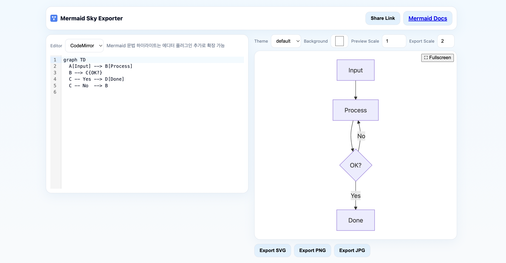

# Mermaid Sky Exporter

Mermaid 다이어그램을 브라우저에서 즉시 렌더링하고 SVG, PNG, JPG로 내보낼 수 있는 Next.js 앱입니다. Monaco와 CodeMirror 편집기 전환, URL 기반 공유 링크, 모바일 최적화 레이아웃, 설치 가능한 PWA 흐름, 핵심 자산 중심의 가벼운 오프라인 앱 셸을 제공합니다.



## 주요 기능

- 실시간 Mermaid 렌더링과 자동 맞춤 미리보기
- Monaco / CodeMirror 편집기 전환
- SVG / PNG / JPG 내보내기와 비율 프리셋
- URL 인코딩 기반 공유 링크
- 모바일 브라우저에서는 네이티브 공유, 미지원 환경에서는 링크 복사로 폴백
- 모바일에서 겹치지 않도록 정리된 상단 툴바와 export 컨트롤
- 설치 가능한 PWA와 기본 오프라인 앱 셸

## 시작하기

```bash
git clone https://github.com/okorion/mermaid-sky-exporter.git
cd mermaid-sky-exporter
npm install
npm run dev
```

브라우저에서 [http://localhost:3000](http://localhost:3000)을 열면 됩니다.

## PWA 및 모바일 메모

- `app/manifest.ts`와 `public/sw.js`를 통해 PWA 메타데이터와 서비스 워커를 제공합니다.
- 서비스 워커는 production 환경의 secure context 에서만 등록됩니다.
- 캐시는 핵심 same-origin 앱 셸과 정적 자산으로 제한해 일반 웹 배포 동작에 미치는 영향을 최소화했습니다.
- Android/Chromium 계열은 설치 프롬프트가 가능할 때 Install 버튼이 표시됩니다.
- iOS/iPadOS Safari는 설치 버튼 대신 Safari 공유 메뉴의 "홈 화면에 추가" 안내를 표시합니다.
- 오프라인 동작은 최초 1회 이상 정상 로드된 뒤 재방문하는 앱 셸 중심이며, 사용자 다이어그램 상태를 별도 영구 저장하지는 않습니다.
- 상세 구현 메모: [docs/mobile-pwa.md](docs/mobile-pwa.md)

## 기술 스택

- Next.js App Router
- React 19
- TypeScript
- Mermaid.js
- Monaco Editor
- CodeMirror

## License

MIT
